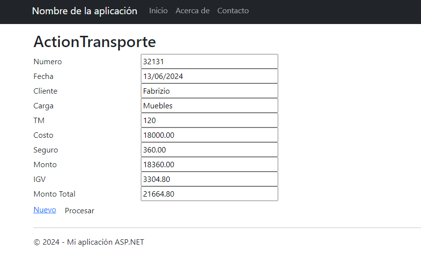

# VentasTransporte
Este proyecto es una aplicación web MVC desarrollada en C# utilizando Visual Studio 2022. Permite calcular el costo de transporte de carga, incluyendo seguro e IGV, basado en los datos ingresados por el usuario.

## Imagen del Proyecto

## Características Principales

- Calcula el costo de transporte según una tarifa base por tonelada métrica.
- Incluye el cálculo del seguro, que corresponde al 2% del costo total.
- Calcula el monto total a pagar, que considera el costo total más el Impuesto General a las Ventas (IGV), aplicando una tasa del 18%.
  
## Tecnologías Utilizadas
- Lenguaje de Programación: C#
- Framework: ASP.NET MVC
- Entorno de Desarrollo: Visual Studio 2022
- Paradigma: Programación Orientada a Objetos (POO)

## Uso
- Ingresa el número de transporte, la fecha, el cliente, el tipo de carga y la cantidad en toneladas métricas (_TM).
- Presiona el botón "Procesar" para calcular y mostrar el costo, seguro, monto total y otros detalles.
